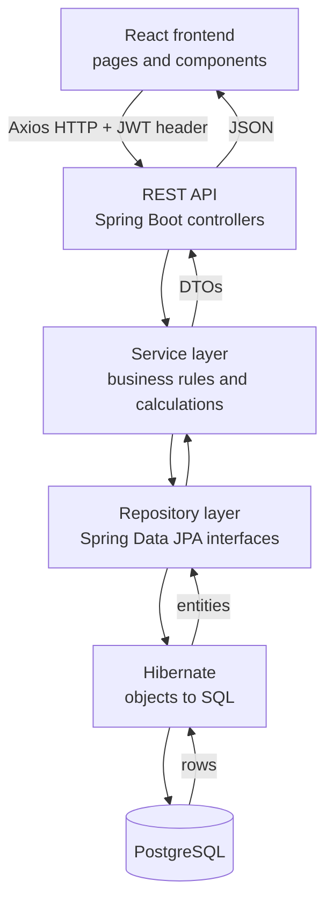
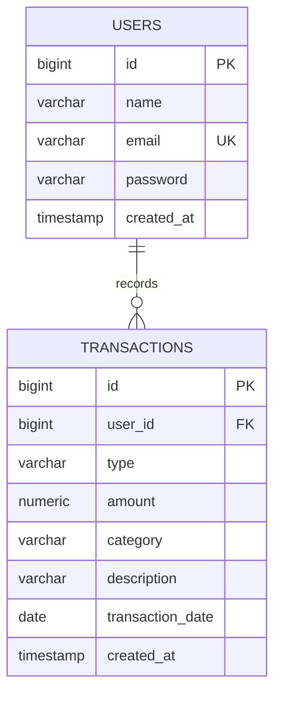
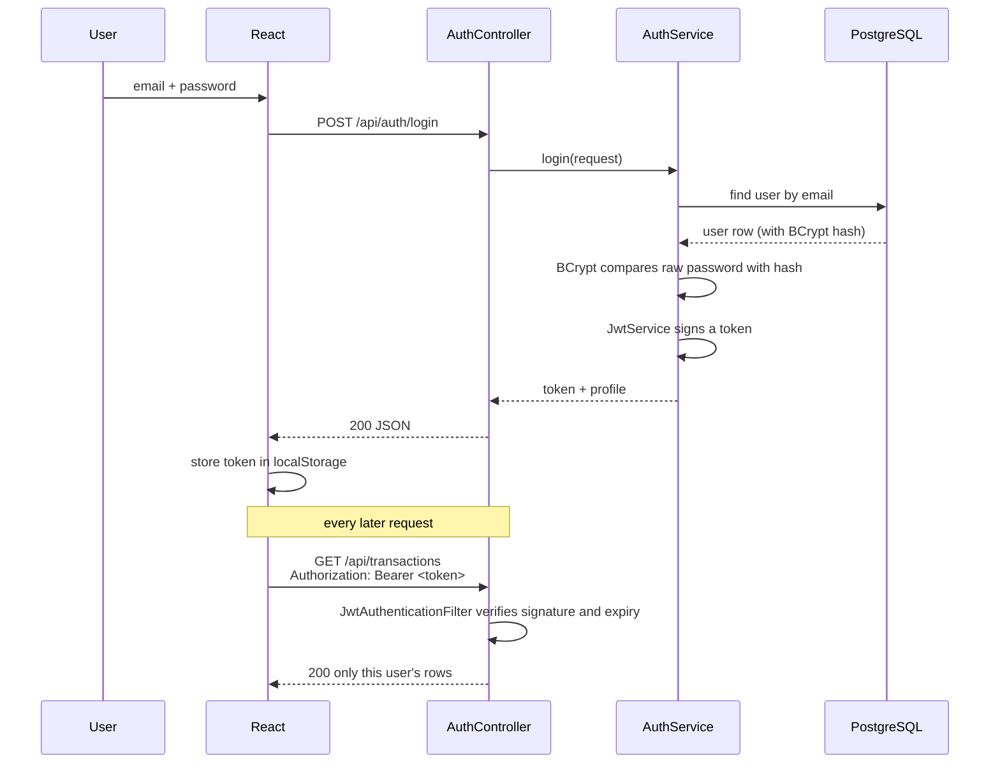

# FinTrack — FinTech Expense Management System

A personal finance web application where a user registers, records income and
expenses, categorises them, filters and edits them, and sees monthly summaries
and charts. Built as a single Spring Boot service with a React frontend and a
PostgreSQL database.

---

## Problem statement

Most people know roughly what they earn and have no idea where it goes. Bank
statements are a flat list of merchant codes: they do not tell you that
₹9,200 went on food this month, or that transport has grown for four months
straight.

FinTrack gives one person a private ledger they actually control — every entry
tagged with a category and a date — and turns that ledger into the two numbers
that matter (what came in, what went out) plus the breakdown behind them.

---

## Features

**Accounts and security**
- Register and log in; passwords stored as BCrypt hashes
- Stateless JWT authentication; every API route except register/login requires a valid token
- A user can only ever read, edit or delete their own transactions

**Transactions**
- Add income or expense with amount, category, date and description
- View, edit and delete
- Amount validated as greater than zero, on the backend

**Filtering and sorting**
- By type, category, date range, or a month/year shortcut
- Sort by date, newest or oldest first

**Dashboard**
- Total income, total expenses, current balance
- Current-month income and expenses
- Five most recent transactions
- Category pie chart and income-vs-expense bar chart

**Analytics**
- Category-wise expense breakdown for any month
- Income vs expenses for the last 12 months
- Spending trend line
- Monthly summary: income, expenses, balance, transaction count, category totals

**Developer experience**
- Swagger UI with an Authorize button
- Postman collection that stores the JWT automatically
- Centralised error handling with one consistent JSON error shape
- Unit tests for registration, transaction CRUD, ownership rules and monthly maths

**Optional**
- A separate Python script that predicts next month's spending with linear regression. The application runs fully without it.

---

## Tech stack

| Layer | Choice |
|---|---|
| Language | Java 17 |
| Framework | Spring Boot 3.2 (Web, Data JPA, Security, Validation) |
| ORM | Hibernate via Spring Data JPA |
| Auth | Spring Security + JJWT 0.12 |
| Database | PostgreSQL |
| Build | Maven |
| Frontend | React 18, Vite, React Router, Axios, Recharts |
| Docs | springdoc-openapi (Swagger UI) |
| Tests | JUnit 5, Mockito, AssertJ |
| Optional ML | Python, NumPy |

Deliberately **not** used: microservices, Kafka, Redis, Kubernetes. A single
monolith is the right size for this problem, and being able to say *why* is
worth more in an interview than a diagram full of boxes.

---

## Architecture



Each layer only talks to the one below it. Controllers never touch the database,
services never build HTTP responses, and entities never leave the service layer —
they are converted to DTOs first.

---

## Project structure

```
fintrack/
├── backend/
│   ├── pom.xml
│   └── src/
│       ├── main/
│       │   ├── java/com/fintrack/
│       │   │   ├── FinTrackApplication.java
│       │   │   ├── config/        OpenApiConfig
│       │   │   ├── controller/    Auth, Transaction, Dashboard, Analytics, Category
│       │   │   ├── dto/           request and response shapes
│       │   │   ├── entity/        User, Transaction, TransactionType, Category
│       │   │   ├── exception/     GlobalExceptionHandler + custom exceptions
│       │   │   ├── repository/    UserRepository, TransactionRepository
│       │   │   ├── security/      JwtService, JwtAuthenticationFilter, SecurityConfig,
│       │   │   │                  UserPrincipal, CustomUserDetailsService
│       │   │   ├── service/       Auth, Transaction, Dashboard, Analytics
│       │   │   └── util/          TransactionMapper, TransactionSpecifications
│       │   └── resources/application.yml
│       └── test/java/com/fintrack/service/   three test classes
├── frontend/
│   ├── package.json
│   ├── index.html
│   └── src/
│       ├── api/client.js          axios instance + interceptors
│       ├── components/            Navbar, ProtectedRoute, SummaryCard,
│       │                          TransactionTable, TransactionFilters, Message
│       ├── context/AuthContext.jsx
│       ├── pages/                 Login, Register, Dashboard, Transactions,
│       │                          AddTransaction, Analytics
│       ├── utils/format.js
│       ├── App.jsx
│       └── index.css
├── database/
│   ├── schema.sql                 reference DDL
│   └── sample-data.sql            development data
├── ml-service/                    optional, standalone
├── docs/
│   ├── FinTrack.postman_collection.json
│   └── LEARNING_GUIDE.md          the interview prep document
├── .env.example
├── .gitignore
└── README.md
```

---

## Database schema

**users**

| Column | Type | Notes |
|---|---|---|
| id | BIGSERIAL | primary key |
| name | VARCHAR(100) | not null |
| email | VARCHAR(150) | not null, **unique** |
| password | VARCHAR(255) | BCrypt hash |
| created_at | TIMESTAMP | set on insert |

**transactions**

| Column | Type | Notes |
|---|---|---|
| id | BIGSERIAL | primary key |
| user_id | BIGINT | foreign key → users(id), on delete cascade |
| type | VARCHAR(10) | INCOME or EXPENSE |
| amount | NUMERIC(15,2) | must be > 0 |
| category | VARCHAR(30) | FOOD, TRANSPORT, … |
| description | VARCHAR(255) | optional |
| transaction_date | DATE | not null |
| created_at | TIMESTAMP | set on insert |

Indexes: `(user_id)` and `(user_id, transaction_date)`. Every query in the app
begins with "this user's rows", usually inside a date range, so these two cover
nearly all reads.

`NUMERIC(15,2)` maps to `BigDecimal` in Java. Money is never a `double` —
`0.1 + 0.2` in binary floating point is not `0.3`, and a finance app cannot
have that.

### ER diagram



One user has many transactions; each transaction belongs to exactly one user.

---

## API endpoints

Base URL: `http://localhost:8080/api`

### Public

| Method | Path | Body | Success |
|---|---|---|---|
| POST | `/auth/register` | `{name, email, password}` | `201` + token |
| POST | `/auth/login` | `{email, password}` | `200` + token |

Response of both:

```json
{
  "token": "eyJhbGciOiJIUzI1NiJ9...",
  "tokenType": "Bearer",
  "userId": 1,
  "name": "Demo User",
  "email": "demo@fintrack.local"
}
```

### Protected — send `Authorization: Bearer <token>`

| Method | Path | Notes | Success |
|---|---|---|---|
| GET | `/transactions` | filters: `type`, `category`, `startDate`, `endDate`, `month`, `year`, `sort` | `200` |
| POST | `/transactions` | create | `201` |
| GET | `/transactions/{id}` | own transaction only | `200` |
| PUT | `/transactions/{id}` | replace | `200` |
| DELETE | `/transactions/{id}` | | `204` |
| GET | `/dashboard/summary` | totals, month figures, 5 recent | `200` |
| GET | `/analytics/categories` | `?year=&month=` (defaults to this month) | `200` |
| GET | `/analytics/monthly-summary` | `?year=&month=` | `200` |
| GET | `/analytics/monthly` | `?months=6` income vs expense series | `200` |
| GET | `/categories` | the category list for dropdowns | `200` |

Create/update body:

```json
{
  "type": "EXPENSE",
  "amount": 450.50,
  "category": "FOOD",
  "description": "Weekly groceries",
  "transactionDate": "2026-03-12"
}
```

### Status codes used

| Code | When |
|---|---|
| 200 | successful read or update |
| 201 | resource created |
| 204 | deleted, nothing to return |
| 400 | validation failed, bad enum value, malformed JSON |
| 401 | missing, expired or invalid token; wrong password |
| 403 | authenticated but not allowed |
| 404 | transaction does not exist **or belongs to someone else** |
| 409 | email already registered |
| 500 | unexpected server error |

Every error uses one shape:

```json
{
  "timestamp": "2026-03-12T10:15:30.123",
  "status": 404,
  "error": "Not Found",
  "message": "Transaction not found",
  "path": "/api/transactions/42"
}
```

Validation failures add a `fieldErrors` object: `{"amount": "Amount must be greater than zero"}`.

---

## Authentication flow



Logging out deletes the token in the browser. A JWT is stateless, so there is no
server session to destroy — that is the trade-off of JWTs, and a good thing to be
able to explain.

---

## Screenshots

Add yours here before pushing to GitHub. Suggested set:

| Screen | File |
|---|---|
| Login | `docs/screenshots/login.png` |
| Dashboard | `docs/screenshots/dashboard.png` |
| Transactions with filters | `docs/screenshots/transactions.png` |
| Add transaction | `docs/screenshots/add-transaction.png` |
| Analytics | `docs/screenshots/analytics.png` |
| Swagger UI | `docs/screenshots/swagger.png` |

```markdown

```

---

## Installation

### Prerequisites

- Java 17 (`java -version`)
- Maven 3.8+ (`mvn -v`)
- Node.js 18+ (`node -v`)
- PostgreSQL 14+ (`psql --version`)

If you use IntelliJ or VS Code, install the **Lombok** plugin and enable
annotation processing, otherwise getters and setters will look missing.

### PostgreSQL setup

```bash
psql -U postgres
```

```sql
CREATE DATABASE fintrack;
\q
```

The tables are created automatically on the first backend start
(`spring.jpa.hibernate.ddl-auto=update`). `database/schema.sql` is the same
design written by hand, for reference.

### Environment variables

```bash
cp .env.example .env
cp .env.example frontend/.env     # only VITE_API_BASE_URL is read there
```

Fill in `.env`:

| Variable | Meaning |
|---|---|
| `DB_URL` | JDBC URL, e.g. `jdbc:postgresql://localhost:5432/fintrack` |
| `DB_USERNAME` / `DB_PASSWORD` | your PostgreSQL credentials |
| `JWT_SECRET` | **at least 32 characters.** Generate: `openssl rand -base64 48` |
| `JWT_EXPIRATION_MS` | token lifetime, default 86400000 (24h) |
| `SERVER_PORT` | default 8080 |
| `CORS_ALLOWED_ORIGINS` | default `http://localhost:5173` |
| `VITE_API_BASE_URL` | frontend only: `http://localhost:8080/api` |

The application has **no default for `JWT_SECRET`** on purpose: it refuses to
start without one, which makes it impossible to ship a secret by accident.

### Backend setup

```bash
cd backend

# load the variables into this shell (Linux/macOS)
set -a && source ../.env && set +a

mvn clean install
mvn spring-boot:run
```

Windows PowerShell:

```powershell
cd backend
$env:DB_URL="jdbc:postgresql://localhost:5432/fintrack"
$env:DB_USERNAME="postgres"
$env:DB_PASSWORD="yourpassword"
$env:JWT_SECRET="a-long-random-string-of-at-least-32-characters"
mvn spring-boot:run
```

Backend runs on `http://localhost:8080`.

### Frontend setup

```bash
cd frontend
npm install
npm run dev
```

Frontend runs on `http://localhost:5173`.

### Sample data

Register the demo account first so the password is hashed properly, then load
the transactions:

```bash
curl -X POST http://localhost:8080/api/auth/register \
  -H "Content-Type: application/json" \
  -d '{"name":"Demo User","email":"demo@fintrack.local","password":"Demo@12345"}'

psql -U postgres -d fintrack -f database/sample-data.sql
```

That inserts about 30 transactions spread over the last six months, across nine
categories, so the dashboard and every chart have something to show.

---

## Running the application

1. Start PostgreSQL
2. Start the backend (`mvn spring-boot:run` in `backend/`)
3. Start the frontend (`npm run dev` in `frontend/`)
4. Open `http://localhost:5173`, register, and add a transaction

---

## Swagger documentation

With the backend running:

- UI: http://localhost:8080/swagger-ui.html
- Raw spec: http://localhost:8080/v3/api-docs

To call a protected endpoint from Swagger: run `POST /api/auth/login`, copy the
`token` value from the response, click **Authorize** at the top right, paste the
token (just the token, without `Bearer`), and press Authorize.

---

## API testing

Import `docs/FinTrack.postman_collection.json` into Postman. The collection has
three folders — Auth, Transactions, Dashboard & Analytics — and two variables you
may want to check: `baseUrl` and `token`.

Run **Register** (or **Login**) first. A test script on both requests copies the
returned JWT into the `token` variable, and the collection sends
`Authorization: Bearer {{token}}` on every other request, so you never paste a
token by hand. **Create transaction** stores the new id in `transactionId`, which
the get/update/delete requests then use.

Two requests exist to prove the rules hold: *Invalid amount* expects `400`, and
*No token* expects `401`.

Suggested order: Register → Login → Create transaction → List transactions →
List transactions (filtered) → Get by id → Update → Dashboard summary →
Category breakdown → Monthly summary → Delete.

To verify ownership isolation yourself: register a second user, log in as them,
and request the first user's transaction id. You should get `404` — not `403`,
because the API does not admit that the row exists.

---

## Running the tests

```bash
cd backend
mvn test
```

Three test classes, all of them plain unit tests with Mockito (no database
needed):

- `AuthServiceTest` — the stored password is a hash and not the plain text; a duplicate email is rejected before anything is saved
- `TransactionServiceTest` — create, list, get; and the important ones: another user gets `Transaction not found` on read and cannot delete
- `AnalyticsServiceTest` — monthly balance and transaction count, the month-by-month grouping, and rejection of nonsense ranges

---

## Future improvements

- Pagination on `GET /transactions` (`Pageable`) once a user has thousands of rows
- Refresh tokens, so the access token can be short-lived
- Budgets per category, with an alert when spending crosses them
- CSV import from a bank statement and CSV export
- Recurring transactions (rent, salary) created automatically
- Flyway migrations instead of `ddl-auto=update`
- Docker Compose for Postgres + backend + frontend
- A `categories` table if users ever need their own custom categories

---

## ML extension

See `ml-service/README.md`. Short version: a standalone Python script fits a
straight line through your past monthly expense totals and reads off next month's
value, reporting R² so you can tell whether the line means anything, and refusing
to predict at all with fewer than three months of history. It is not wired into
the Java application; the `ml-service/README.md` shows how a FastAPI wrapper and
a `RestClient` call would connect them later.

---

## Learning outcomes

Working through this project covers:

- Layered architecture and why business logic does not belong in a controller
- JPA entity mapping, relationships, and the N+1 problem that `LAZY` fetching creates
- Writing dynamic queries with JPA Specifications instead of one method per filter combination
- How BCrypt hashing and salting work, and why hashes are not encryption
- The full JWT lifecycle: signing, the filter chain, stateless sessions, and the logout trade-off
- Authorisation as a query constraint rather than an `if` statement
- REST conventions, correct status codes, and a single error contract
- DTOs, and why entities should not be serialised straight to JSON
- React state, context, routing, protected routes, and axios interceptors
- Aggregating in SQL rather than in the browser
- Testing with mocks, and choosing which behaviour is worth a test

`docs/LEARNING_GUIDE.md` walks through each module with the data flow, the files
that matter, and the interview questions that come with it.
